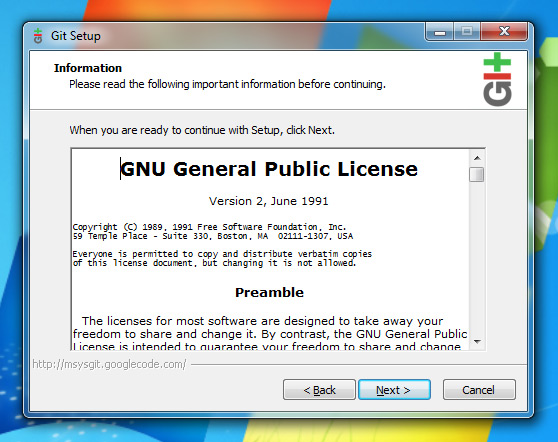
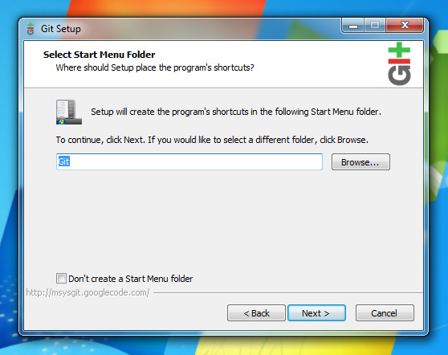
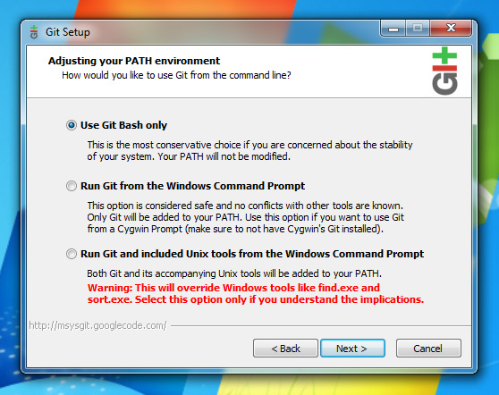
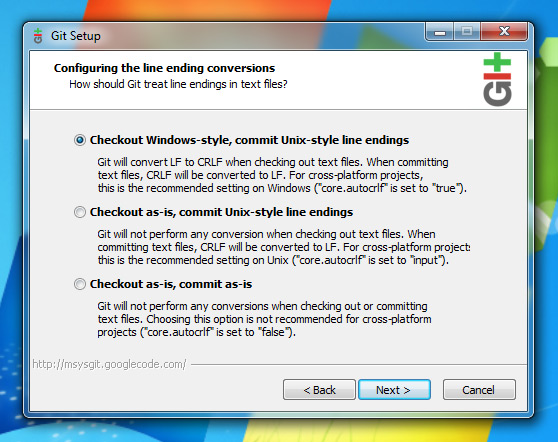
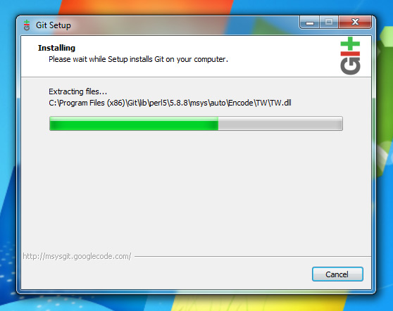
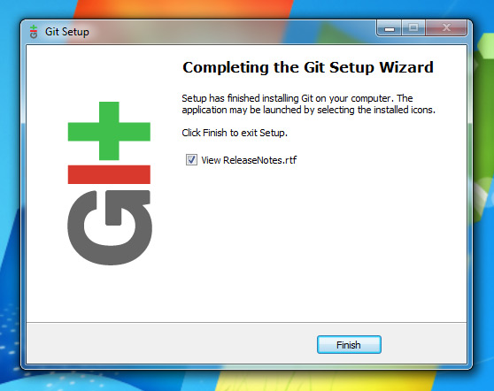

# Instalando e configurando o Git

## OSX
Para instalar o Git no OSX podemos fazer de diversas maneiras, vamos abordar as 3 mais comuns, através do MacPorts, HomeBrew e pelo pacote pré-compilado.
Para todas as opções abaixo é recomendado que você tenha instalado o Xcode

          o HomeBrew

                +         1. Instale o HomeBrew, caso já tenha instalado ir para o próximo passo;
                +         2. Abra o terminal;
                +         3. Digite brew install git;
                +         4. Pronto. Agora é so aguardar e seu git será instalado;

          o MacPorts

                +         1. Instale o MacPorts, caso já tenha instalado basta ir para o próximo passo;
                +         2. Abra o terminal;
                +         3. É muito importante que seu MacPorts esteja atualizado, para isso digite sudo port -v selfupdate;
                +         4. Agora basta digitar sudo port install git-core +svn;
                +         5. Pronto agora é so aguardar e seu git será instalado;

          o Pacote pré-compilado

                +         1. Baixe o pacote pré-compilado através do endereço http://code.google.com/p/git-osx-installer/
                +         2. Monte o disco .dmg
                +         3. Instale o package
                +         4. Pronto. Seu git está instalado;

## LINUX
Para instalar o Git no Linux, também podemos fazer de várias formas. Dependendo da distribuição que você usar pode ser extremamente simples.

          o Debian / Ubuntu

                +         1. Abra um terminal de digite: sudo aptitude install git-core;

## WINDOWS

<del>-- alguém usa Windows aqui???
-- mesmo que ninguém use, acho interessante pesquisármos e incluirmos essa informação, pra ficar algo completo =]  (by Catón)
msysgit é o ambiente melhor pra windows, depois ajudo nisso (qmx)</del>

Para instalar o git no Windows utilizaremos o msysgit por ser considerado o melhor ambiente para o mesmo.

	+	1. Acesse a página de downloads do msysgit em http://code.google.com/p/msysgit/downloads/list
	+	2. Faça download do arquivo com o nome Git-X.X.X-previewYYYYYYYY.exe onde X são os números da versão e Y a data do lançamento.  Faça o download do mais novo se houver mais de um neste formato.
	+	3. Confirme todas as opções em next devido às opções padrões serem recomendadas na instalação, veja as imagens abaixo. Até confirmar o finish.
	+	4. Pronto. Seu git está instalado;

### Imagens de instalação no Windows	

