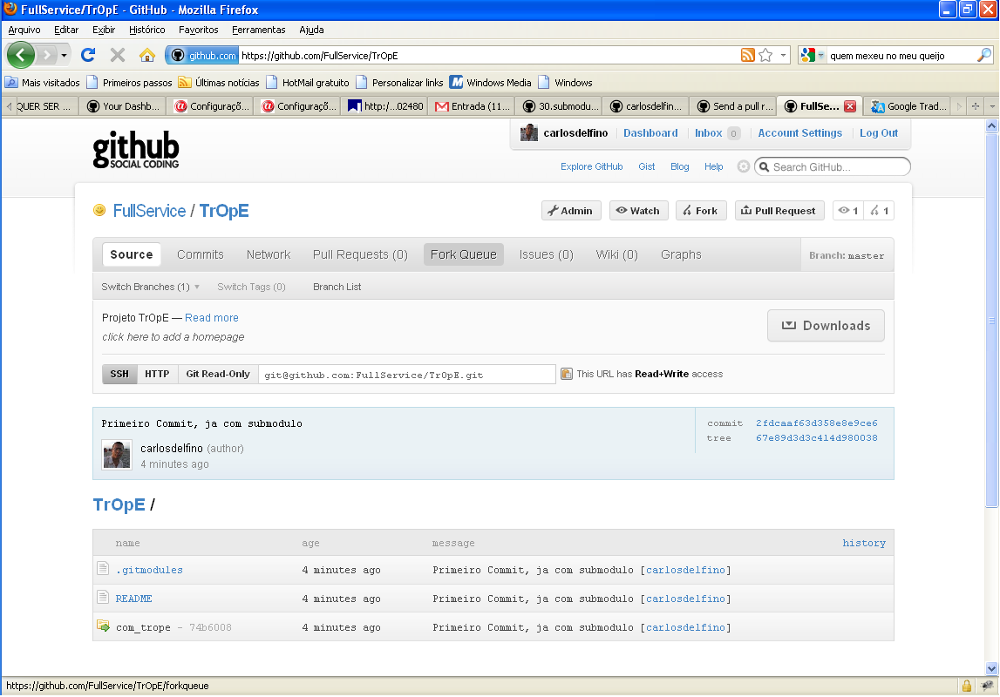

# Criando um Super Projeto no GITHub
Para atuar no GitHub com submodulo é bem simples. 

Se vc já criou seus projetos, você não precisa fazer nenhuma mudança, você 
poderá selecionar um deles para ser seu super projeto ou poderá criar um novo 
para isto.

Porem é fundamental que todos os projetos já estejam bem configurados integrados
adequadamente ao GitHub, e principalmente que o projeto principal, nosso super 
projeto, esteja configurado para que o github tenha seu nome remoto como "origin"

Vamos lá então

# Criando seu super projeto no GITHub.
Como dito anteriormente, você não precisa criar um novo projeto
mas se isto vier a ser necessário, basta criar um projeto como de costume

## Configurando seu Super Projeto para receber os Submodulos/Sub-projetos
Antes de tudo crie na sua area de trabalho seu repositorio local

    $ mkdir /d/workspace-csat/TrOpE
    $ git init
    Initialized empty Git repository in d:/workspace-csat/TrOpE/.git/
    
Pronto agora façamos como de costume a configuração do repositorio local
para que este se conecte ao GitHub como ele sendo o "origin"

    $ git remote add origin git@github.com:FullService/TrOpE.git
    $ git config branch.master.remote origin
    $ git config branch.master.merge refs/heads/master

Agora criemos um primeiro arquivo, como sugere o GitHub vamos criar o README:
        
    Carlos Delfino@FULL-MOBILE /d/workspace-csat/TrOpE (master)
    $ touch README
    
    Carlos Delfino@FULL-MOBILE /d/workspace-csat/TrOpE (master)
    $ git add README
    
Aqui você já pode fazer seu primeiro commit do projeto, eu optei para simplicar 
criar o arquivo README vazio, e também fazer o deposito (commit) e envio (push)
apenas no final desta etapa.

    Carlos Delfino@FULL-MOBILE /d/workspace-csat/TrOpE (master)
    $ git submodule add git@github.com:FullService/com_trope.git com_trope
    Cloning into com_trope...
    Enter passphrase for key '/c/Documents and Settings/Carlos Delfino/.ssh/id_dsa'
    
    remote: Counting objects: 34, done.
    remote: Compressing objects: 100% (25/25), done.
    remote: Total 34 (delta 8), reused 0 (delta 0)
    Receiving objects: 100% (34/34), 6.19 KiB, done.
    Resolving deltas: 100% (8/8), done.
    warning: LF will be replaced by CRLF in .gitmodules.
    The file will have its original line endings in your working directory.

    Carlos Delfino@FULL-MOBILE /d/workspace-csat/TrOpE (master)
    $ git commit -m "Primeiro Commit, ja com submodulo"
    [master (root-commit) 2fdcaaf] Primeiro Commit, ja com submodulo
    warning: LF will be replaced by CRLF in .gitmodules.
    The file will have its original line endings in your working directory.
     2 files changed, 4 insertions(+), 0 deletions(-)
     create mode 100644 .gitmodules
     create mode 100644 README
     create mode 160000 com_trope

    Carlos Delfino@FULL-MOBILE /d/workspace-csat/TrOpE (master)
    $ git push -u origin master
    Enter passphrase for key '/c/Documents and Settings/Carlos Delfino/.ssh/id_dsa':
    
    Counting objects: 4, done.
    Delta compression using up to 2 threads.
    Compressing objects: 100% (3/3), done.
    Writing objects: 100% (4/4), 375 bytes, done.
    Total 4 (delta 0), reused 0 (delta 0)
    To git@github.com:FullService/TrOpE.git
     * [new branch]      master -> master
    Branch master set up to track remote branch master from origin.

Pronto como pode ver o processo é quase padrão. Visitando agora  página do GitHub
verá que os commits relativos ao submodulos são apresentados de forma diferente

Veja a imagem abaixo: 

Obseve que é criado um link, onde deveria ser o diretorio de seu subprojeto ele 
irá apontar para o repositorio de seu subprojeto desde que seja no GitHub. Em
versões futuras estaremos mostrando como fazer com Repositorios externos.

## Mais um Comando para finalizar.

Porem não terminamos, agora pressisamos fazer o INIT dos submodulos dentro do 
Super Projeto. Para isto execute o comando:

    Carlos Delfino@FULL-MOBILE /d/workspace-csat/TrOpE (master)
    $ git submodule init
    Submodule 'com_trope' (git@github.com:FullService/com_trope) registered for path
     'com_trope'

Veja que agora ele registrou o submodulo e já configurou o GitHub.

# Alterando seu SubModulo localmente no Super Projet
Agora que você tem um super projeto que agrega varios submodulos, pode vir a querer
Trabalhar no submodulo, não há problemas nisto, então vamos lá.

Usando seu submodulo presente na pasta do super projeto crie os seguintes 
diretorios:

    Carlos Delfino@FULL-MOBILE /d/workspace-csat/TrOpE (master)
    $ cd com_trope
    
    Carlos Delfino@FULL-MOBILE /d/workspace-csat/TrOpE/com_trope (master)
    $ mkdir administrator 
    
    Carlos Delfino@FULL-MOBILE /d/workspace-csat/TrOpE/com_trope (master)
    $ mkdir site
    
    Carlos Delfino@FULL-MOBILE /d/workspace-csat/TrOpE/com_trope (master)
    $ touch adminstrator/index.html
    
    Carlos Delfino@FULL-MOBILE /d/workspace-csat/TrOpE/com_trope (master)
    $ touch site/index.html
    
    Carlos Delfino@FULL-MOBILE /d/workspace-csat/TrOpE/com_trope (master)
    $ git add administrator/ site/ 
    
    Carlos Delfino@FULL-MOBILE /d/workspace-csat/TrOpE/com_trope (master)
    $ git commit -m "Criado os diretorios para demonstração de atualização do submodulo dentro do super projeto"
    [master 6f5c08d] Criado os diretorios para demonstração de atualização do submodulo dentro do super projeto
     0 files changed, 0 insertions(+), 0 deletions(-)
     create mode 100644 administrator/index.html
     create mode 100644 site/index.html
    
    Carlos Delfino@FULL-MOBILE /d/workspace-csat/TrOpE/com_trope (master)
    $ git push
    Enter passphrase for key '/c/Documents and Settings/Carlos Delfino/.ssh/id_dsa':
    
    Counting objects: 5, done.
    Delta compression using up to 2 threads.
    Compressing objects: 100% (2/2), done.
    Writing objects: 100% (4/4), 491 bytes, done.
    Total 4 (delta 0), reused 1 (delta 0)
    To git@github.com:FullService/com_trope
       74b6008..6f5c08d  master -> master
       
Observe que o processo é simplesmente o mesmo, agora visite a página do super 
projeto, e observe que lá não há nenhuma referencia a esta atualização, porem 
visitando a página do submodulo, você verá que o github depositou os mudandaças
lá.

Para que você tenha as mudanças também publicadas no super projeto, precisa 
atentar para o fato que os comandos devem ser executados no raiz do super 
projeto. Então, execute os mesmos comandos no raiz do super projeto:

    Carlos Delfino@FULL-MOBILE /d/workspace-csat/TrOpE (master)
    $ git commit -a -m "Criado os diretorios iniciais para Backend e Frontend do co
    mponente, pelo subprojeto"
    [master e7aded7] Criado os diretorios iniciais para Backend e Frontend do componente, pelo subprojeto
     1 files changed, 1 insertions(+), 1 deletions(-)

    Carlos Delfino@FULL-MOBILE /d/workspace-csat/TrOpE (master)
    $ git push
    Enter passphrase for key '/c/Documents and Settings/Carlos Delfino/.ssh/id_dsa':
    
    Counting objects: 6, done.
    Delta compression using up to 2 threads.
    Compressing objects: 100% (4/4), done.
    Writing objects: 100% (4/4), 664 bytes, done.
    Total 4 (delta 2), reused 0 (delta 0)
    To git@github.com:FullService/TrOpE.git
       15d0042..e7aded7  master -> master

Visitando a página do projeto verá que o ID do commit mudou.

Vejamos então se fizermos o processo inverso:

    Carlos Delfino@FULL-MOBILE /d/workspace-csat/TrOpE/ (master)
    $ mkdir com_trope/administrator/controllers

    Carlos Delfino@FULL-MOBILE /d/workspace-csat/TrOpE/ (master)
    $ touch com_trope/administrator/controllers/index.html

    Carlos Delfino@FULL-MOBILE /d/workspace-csat/TrOpE (master)
    $ git commit -a -m "Criado os diretorio para controllers do backend do componente, pelo subprojeto"
    # On branch master
    # Changed but not updated:
    #   (use "git add <file>..." to update what will be committed)
    #   (use "git checkout -- <file>..." to discard changes in working directory)
    #   (commit or discard the untracked or modified content in submodules)
    #
    #       modified:   com_trope (untracked content)
    #
    no changes added to commit (use "git add" and/or "git commit -a")
    
Obseve que mesmo eu informando ao commit que ele deve adicionar todas as 
alterações efetuadas, ele não as adiciona, mas diz que o diretorio do subprojeto
tem conteudo não adicionado.

Mesmo que você tente efetuar o git add não irá adiantar, e se tentar adicionar o 
o arquivo com seu path completo irá receber uma mensagem de erro visto que o 
arquivo pertence ao projeto.

Portanto é necessário que faça primeiro o add e commit diretamente no diretorio 
do projeto, em seguida atualizar o projeto principal conforme demonstrado.

# Buscando o super projeto no repositorio e seus submodulos

O processo para obter o super projeto é o mesmo para qualquer projeto, com a 
diferença ao que se refere ao conteúdo do subprojeto. Portanto inicie fazendo um 
clone do super projeto original no github usando o comando padrão:

    Carlos Delfino@FULL-MOBILE /tmp/teste
    $ git clone git@github.com:FullService/TrOpE.git
    Cloning into TrOpE...
    Enter passphrase for key '/c/Documents and Settings/Carlos Delfino/.ssh/id_dsa':
    
    remote: Counting objects: 23, done.
    remote: Compressing objects: 100% (21/21), done.
    remote: Total 23 (delta 11), reused 0 (delta 0)
    Receiving objects: 100% (23/23), 3.07 KiB, done.
    Resolving deltas: 100% (11/11), done.
    
    Carlos Delfino@FULL-MOBILE /tmp/teste
    $ cd TrOpE/

Agora execute o comando para inicializar os submodulos, caso queira inicializar 
apenas um determinado submodulo utilize o nome do submodulo em seguida ao comando
"init"
    
Veja em seguida que mesmo apos executar a inicialização do super projeto o submodulo ainda está
vazio.
    
    Carlos Delfino@FULL-MOBILE /tmp/teste/TrOpE (master)
    $ git submodule init
    Submodule 'com_trope' (git@github.com:FullService/com_trope) registered for path 'com_trope'

    Carlos Delfino@FULL-MOBILE /tmp/teste/TrOpE (master)
    $ cd com_trope/

    Carlos Delfino@FULL-MOBILE /tmp/teste/TrOpE/com_trope (master)
    $ ls -lha
    total 0
    drwxr-xr-x    2 Carlos D Administ        0 Feb 26 23:15 .
    drwxr-xr-x    4 Carlos D Administ        0 Feb 26 23:15 ..

Agora retorne ao raiz do super projeto e atualize os subprojetos, assim eles 
serão preenchidos com seus respectivos conteudos, se informar o nome do subprojeto
este será o unico a ser atualizado.
 
    Carlos Delfino@FULL-MOBILE /tmp/teste/TrOpE/com_trope (master)
    $ cd ..

    Carlos Delfino@FULL-MOBILE /tmp/teste/TrOpE (master)
    $ git submodule update
    Cloning into com_trope...
    Enter passphrase for key '/c/Documents and Settings/Carlos Delfino/.ssh/id_dsa':
    
    remote: Counting objects: 37, done.
    remote: Compressing objects: 100% (27/27), done.
    remote: Total 37 (delta 9), reused 0 (delta 0)
    Receiving objects: 100% (37/37), 6.51 KiB, done.
    Resolving deltas: 100% (9/9), done.
    Enter passphrase for key '/c/Documents and Settings/Carlos Delfino/.ssh/id_dsa':
    
    Submodule path 'com_trope': checked out '6f5c08d5157631a557ac688b211c0d4576348c10'
    
 # Conclusões
 Este capitulo ainda tem muito a ser ampliado, e também em capítulos a frente 
 quando discutirmos a criação de páginas para o projeto no GitHub e o uso do Wiki
 do GitHub, será apresentado uma forma bem interessante de se usar os SubModulos
 para gerir seu projeto completamente de um único lugar.
 
 Portanto não apenas em grandes projetos é util este conceito de subprojeto. 
 Seja um pequeno projeto hospedado no GitHub bem estruturado com que use os 
 recusos do site, ou um grande projeto, o uso de SubModulos será valioso. 