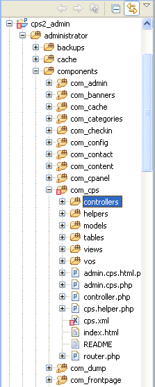
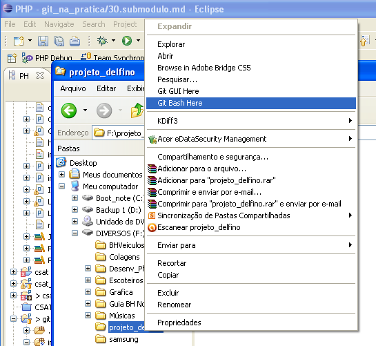

# Sobre este tutorial
Este tutorial foi feito em sua totalidade com base no tutorial disponível na
página: https://git.wiki.kernel.org/index.php/GitSubmoduleTutorial

Antes de optar em produzir este tutorial pesquisei por vários sites, alguns 
estão listados no arquivo 99.referencias.md

# Trabalhando com Módulos/Projetos que possuem Submódulos/Subprojetos

O uso de submódulos vem da necessidade de se dividir o projeto em subprodutos.
Equipe com Programadores e Designers no mesmo projeto e a necessidade de 
independência no trabalho das partes do produto de seu projeto. Isto demonstra
que seu projeto está bem estruturado e se for um software que tem sua camadas
com baixo acoplamento. Seja um projeto de maior porte ou não, o uso de 
Submódulos auxilia no acesso as partes do projeto conforme a atuação de cada 
equipe.

Vejamos um projeto para o joomla como base para nosso exemplo.

O joomla possui diversos tipos de extensões, listadas abaixo, cada extensão 
tem funcionalidades muito claras e atuam de formas bem diferentes uma da outra.
Tendo o projeto uma estrutura complexa como este que será nosso exemplo, poderá
ser preciso que ele seja quebrado em partes (extensões, documentação, 
codificação logica, codificação gráfica). Principalmente se cada parte do
projeto for desenvolvida por uma equipe ou profissional distinto, e também houver
a necessidade de se usar ferramentas diferentes, que possam até vir a danificar
acidentalmente parte do material.

Neste exemplo não entrarei a níveis de complexidade que envolva mais de uma 
ferramenta, so para atiçar a curiosidade: já se perguntou como manter o codigo
totalmente longe do webdesigner num projeto?

Então ai está um situação bem interessante onde um submodulo/subprojeto seria 
baixado pelo desenvolvedor e outro pelo webdesigner.

Como dito o Joomla possui três tipos de extensões:

* Componentes
* Módulos
* Plugins
* Templates

Para cada um destas extensões você precisará criar um submodulo, assim será mais
fácil gerencia-las e controlar os commit, em se tratando do Joomla uma extensão
poderá ser dividido em submodulos novamente, ou seja submodulos dentro de 
submodulos, para facilitar os testes durante o desenvolvimento, já que, a 
estrutura de diretórios instalada é diferente do pacote de distribuição e da 
instalação realizada.
 
## Conhecendo a Estrutura de um Componente
Para que possamos entender melhor esta tal necessidade de dividir o projeto
em submódulos, vamos conhecer a estrutura de um projeto de componente Joomla.

Atenção: Nossa intenção não é ensinar a desenvolver um componente no Joomla, 
mas precisamos compreender a estrutura para identificar a necessidade.

Na figura abaixo esta a estrutura de um Componente em um pacote de instalação:
 

Já esta outra figura mostra o mesmo pacote instalado, primeiro o Submódulo da
administração:

E seguinte figura apresenta o Submódulo do site:

Na primeira figura dois diretórios principais, e alguns arquivos no raiz. O 
primeiro diretório que optei em chamar "backend" contem os arquivos que compõe
a parte administrava do componente. O outro diretório chamado "frontend" contem
os arquivos que são usados para construir a aparte do componente apresentada
no site.

Os outros arquivos apenas o cps.xml será usado na instalação e será copiado 
para a parte administrativa.

Nesta fase não irei entrar em detalhes sobre as duas imagens, mas com um pouco
de comparação será fácil entender. O importante era perceber que o nosso 
projeto usa uma estrutura complexa que em cada ciclo de vida do desenvolvimento
se apresenta montada de forma diferente.

Agora vem a parte que mais nos importa.

## Iniciando nosso Superprojeto dividido em Submódulos
### Montando nossa estrutura de diretório para trabalhar com Submódulos no Git

No capítulo anterior, mostramos a estrutura de um componente no Joomla, optamos 
pelo componente apenas porque é a extensão mais complexa, principalmente se 
tratando de estrutura de diretório.

### Criando os Diretórios
Então vamos começar, vamos precisar de dois diretórios, um "público" e outro 
"privado".

O diretório público será usado para concentrar os projetos em um so repositório, 
e enviarmos as informações a outros [repositorios](30.Submodulo.md) externos.  
Este diretório será chamado de "repositorio".

Então em sua linha de comando digite: 

`mkdir /d/repositorio`

Observe que estou usando o shell do GIT, o que me faz ter o mesmo ambiente e
nomenclatura para o "Sistema de Arquivos", seja no Linux, Windows ou MacOs.

Agora vamos ao diretório privado, nosso diretório de desenvolvimento, conterá os 
Submodulos/Subprojetos separadamente, poder ser, por exemplo, a pasta onde 
você tem seus projetos no Eclipse, ou seja seu "Workspace"

Caso não use o eclipse, digite o comando:

`mkdir /d/workspace`

### Criando os Subprojetos no diretório de desenvolvimento (Privado)

Pronto, vamos agora criar no diretório privado "workspace" uma pasta para cada
projeto:

1. Crie o diretório do Subprojeto.
1. Crie os arquivos README (uma boa prática) para descrever cada Subprojeto.
1. Inicialize o repositório local do git
1. Adicione o arquivo "README" ao 
INDEX do HEAD
1. Então faça o primeiro commit.

Até aqui procedimento padrão, mas não acaba por ai, o processo parece um pouco
complexo mas é feito uma única vez:

1. Clonamos o projeto com  o parâmetro "bare" para o diretório do super projeto
1. Adicionamos o repositório "bare" como sendo o "origin"
1. Faça a configuração do repositório para uso do Branch remoto 

Para facilitar segue um script com todos os comandos para esta etapa.

    $ cd /d/workspace
    
    $ for m in com_cps mod_cps plg_cps documentos
    > do
    >	mkdir $m
    >	cd $m
    >	echo "# Extenão $m para o Joomla" > README
    >	
    >	git init
    >	git add README
    >	git commit -m "Primeiro commit, Submodulo de desenvolvimento: $m"
    >	
    >	git clone --bare . /d/repositorio/$m.git
    >	git remote add origin /d/repositorio/$m.git
    >	git config branch.master.remote origin
    >	git config branch.master.merge refs/heads/master
    >	
    > 	cd ..
    > done;

### Montando a Estrutura no Repositório do Superprojeto

No diretório que conterá o superprojeto, ou seja o pacote completo de todo
o projeto execute as seguinte atividades:

1. Inicialize o repositório local do git
1. Crie um arquivo README e descreva o Superprojeto
1. Adicione o Arquivo README ao INDEX do HEAD
1. Faça o primeiro commit

Até então como no diretório de desenvolvimento o procedimento inicia como 
padrão. Agora vamos aos comandos específicos para se criar a estrutura de
forma adequada a esta modalidade de trabalho:

1. Clone o Superprojeto no diretório base de desenvolvimento com a opção "bare"
1. Adicione este novo repositório "bare" as configurações de repositórios 
remotos 
1. Faça a configuração final para sincronismo do branch remoto 

    $ cd /d/workspace
    $ mkdir superprojeto
    $ cd superprojeto 
    $ git init
    $ echo "Projeto Global do CPS" > README
    $ git add README
    $ git commit -m "Primeiro Commit, Projeto Global do CPS"
    $ git clone --bare . /d/repositorio/superprojeto.git
    $ git remote add origin /d/repositorio/superprojeto.git
    $ git config branch.master.remote origin
    $ git config branch.master.merge refs/heads/master
    

Até este momento não fizemos nada para adicionar os Subprojetos tanto da pasta 
de desenvolvimento como nas pasta privada.
 
### Adicionando os Submódulos ao Super Projeto

Para adicionar o Submódulos ao Superprojeto devemos usar o novo comando 
existente apenas na versão 1.5.3 ou superior. Este comando efetua um tipo de 
checkout específico para Submódulos.

Antes de continuarmos, apenas a titulo de averiguação e perceber as mudanças, 
entre no diretório e liste seu conteúdo, você verá que so tem o próprio 
diretório  o repositório local do GIT e o arquivo README criado.

    $ cd /d/workspace/superprojeto
    $ ls -a
    . .. .git README

Agora vamos fazer os checkouts dos módulos execute o script abaixo para que os 
comandos sejam executados em todos os submódulos/subprojetos em um único 
processo e de forma mais rápida.

    $ for m in com_cps mod_cps plg_cps documentos
    $ do
    $	git submodule add /d/repositorio/$m.git $m;
    $ done
    $ ls -a
    .  ..  .git  .gitmodules  README  com_cps  documentos  mod_cps  plg_cps

Pronto, agora temos os Submódulos/Subprojetos dentro do Superprojeto.

Mas antes de prosseguir, ainda não acabamos, vamos entender o que o comando
"git submodule add" produz.

* Primeiro ele clona o Submódulo no diretório corrente criando um diretório de
mesmo nome e executa o checkout
* Em seguida ele adiciona o caminho do Submódulo para o arquivo .gitmodules
e adiciona o arquivo ao INDEX do HEAD do superprojeto, deixando pronto para 
o commit
* E finalmente adiciona o ID do commit atual do Submódulo ao INDEX do HEAD do
superprojeto, deixando pronto para o commit;

### Analisando os resultados até o momento

Experimente visualizar o arquivo .submodules para se familiarizar com as 
mudanças.

Para o nosso exemplo veja o resultado, no meu caso estou trabalhando sobre o
windows:
 
    $ cat .gitmodules
    [submodule "com_cps"]
            path = com_cps
            url = d:/repositorio/com_cps.git
    [submodule "mod_cps"]
            path = mod_cps
            url = d:/repositorio/mod_cps.git
    [submodule "plg_cps"]
            path = plg_cps
            url = d:/repositorio/plg_cps.git
    [submodule "documentos"]
            path = documentos
            url = d:/repositorio/documentos.git

Se executarmos o comando git status, veremos:

    $ git status
     # On branch master
     # Changes to be committed:
     #   (use "git reset HEAD <file>..." to unstage)
     #
     #       new file:   .gitmodules
     #       new file:   com_cps
     #       new file:   documentos
     #       new file:   mod_cps
     #       new file:   plg_cps
     #

### Cada Submódulo é um projeto independente

Mesmo apos o checkout dentro do superprojeto, os Submódulos, permanecem 
independentes, execute os comandos e veja os resultados, mantive todas as 
informações para que possam ver a estrutura completa como resultado:

    Carlos Delfino@FULL-MOBILE /d/workspace/superprojeto (master)
    $ cd documentos/
    
    Carlos Delfino@FULL-MOBILE /d/workspace/superprojeto/documentos (master)
    $ ls -a
    .  ..  .git  README

    Carlos Delfino@FULL-MOBILE /d/workspace/superprojeto/documentos (master)
    $ git branch
    * master
    

No superprojeto da mesma forma:

    Carlos Delfino@FULL-MOBILE /d/workspace/superprojeto/documentos (master)
    $ cd ..
    
    Carlos Delfino@FULL-MOBILE /d/workspace/superprojeto (master)
    $ cat .git/config
    [core]
            repositoryformatversion = 0
            filemode = false
            bare = false
            logallrefupdates = true
            symlinks = false
            ignorecase = true
            hideDotFiles = dotGitOnly
    [remote "origin"]
            url = d:/repositorio/superprojeto.git
            fetch = +refs/heads/*:refs/remotes/origin/*
    [branch "master"]
            remote = origin
            merge = refs/heads/master
    

### Finalizando esta etapa, executando o último commit

Vamos finalizar por aqui, depositando todo o trabalho no repositório de forma
que outros programadores possam baixa-los por inteiro ou seus módulos.

Faça o commit normalmente do super projeto:

    Carlos Delfino@FULL-MOBILE /d/workspace/superprojeto (master)
    $ git commit -m "Adicionando os Submodulos ao projeto principal"
    [master 1d03375] Adicionando os Submodulos ao projeto principal
    warning: LF will be replaced by CRLF in .gitmodules.
    The file will have its original line endings in your working directory.
     5 files changed, 16 insertions(+), 0 deletions(-)
     create mode 100644 .gitmodules
     create mode 160000 com_cps
     create mode 160000 documentos
     create mode 160000 mod_cps
     create mode 160000 plg_cps
    

Execute o envio do superprojeto para nosos repositório "publico local" e 
execute o init do Submodulo.

    Carlos Delfino@FULL-MOBILE /d/workspace/superprojeto (master)
    $ git push
    Counting objects: 4, done.
    Delta compression using up to 2 threads.
    Compressing objects: 100% (3/3), done.
    Writing objects: 100% (3/3), 554 bytes, done.
    Total 3 (delta 0), reused 0 (delta 0)
    Unpacking objects: 100% (3/3), done.
    To d:/repositorio/superprojeto.git
       207223f..1d03375  master -> master
    
    Carlos Delfino@FULL-MOBILE /d/workspace/superprojeto (master)
    $ git submodule init
    Submodule 'com_cps' (d:/repositorio/com_cps.git) registered for path 'com_cps'
    Submodule 'documentos' (d:/repositorio/documentos.git) registered for path 'documentos'
    Submodule 'mod_cps' (d:/repositorio/mod_cps.git) registered for path 'mod_cps'
    Submodule 'plg_cps' (d:/repositorio/plg_cps.git) registered for path 'plg_cps'
    
     

## Agora vamos a uma outra etapa levando seu projeto com você

Agora que já temos a estrutura do projeto pronta e podemos trabalhar fácilmente
com Submodulos, com um pouco mais de criatividade podemos inserir novos
Subprojetos rápidamente.

Vou me basear no fato de podermos termos quantos repositorios quisermos para
que possamos criar um novo repositorio como se fosse outro programador que 
precisa de uma copia do meu projeto em sua máquina.

Meu amigo acabou de chegar aqui então vou usar seu pendrive para permitir
que ele leve uma copia de meu projeto para seu escritorio.

Para este transporte, vou criar um diretorio chamado "projeto_delfino" no 
pendrive de meu colega, e abri-lo com o shell do GIT, veja a figura:

então faremos:

* Criaremos uma pasta para os projetos chamada workspace
* Faremos um clone do projeto na pasta repositório
* Analisaremos o conteúdo da pasta superprojeto

    
    Carlos Delfino@FULL-MOBILE /f/projeto_delfino
    $ mkdir workspace
    
    Carlos Delfino@FULL-MOBILE /f/projeto_delfino
    $ cd !$
    cd workspace
    
    Carlos Delfino@FULL-MOBILE /f/projeto_delfino/workspace
    $ git clone /d/repositorio/superprojeto.git
    Cloning into superprojeto...
    done.
    
    Carlos Delfino@FULL-MOBILE /f/projeto_delfino/workspace
    $ cd superprojeto
    
    Carlos Delfino@FULL-MOBILE /f/projeto_delfino/workspace/superprojeto (master)
    $ ls -a
    .  ..  .git  .gitmodules  README  com_cps  documentos  mod_cps  plg_cps
    

Pronto, porem não terminamos, veja, foi criado os diretórios de cada 
Submodulo mas verifique seu conteúdo dos:

    $ ls -a documentos

Eles ainda estão vasios.

    $ git submodule status
    -381188a862dce5c227453ba05980a0b7b2f6a913 com_cps
    -1c5c177c895516f5710adf24f31e156831dbe09a documentos
    -bddff8da8020b4253f6c3764394732c88082eb2f mod_cps
    -3065b74fc1b1dea70875b7ed91b803851bc7b6c6 plg_cps

Para reconstituir os Submodulos deve seguir dois passos:

* primeiro inicialize os Submodulos localmente com "git submodule init"
não precisa entrar em cada Submodulo para isto, apenas execute o comando na 
pasta do Superprojeto
* em seguida atualize os Submodulos localmente com "git submodule update"

    Carlos Delfino@FULL-MOBILE /f/projeto_delfino/workspace/superprojeto (master)
    $ git submodule init
    Submodule 'com_cps' (d:/repositorio/com_cps.git) registered for path 'com_cps'
    Submodule 'documentos' (d:/repositorio/documentos.git) registered for path 'documentos'
    Submodule 'mod_cps' (d:/repositorio/mod_cps.git) registered for path 'mod_cps'
    Submodule 'plg_cps' (d:/repositorio/plg_cps.git) registered for path 'plg_cps'
     
    $ git submodule update
    Cloning into com_cps...
    done.
    Submodule path 'com_cps': checked out '381188a862dce5c227453ba05980a0b7b2f6a913'
    Cloning into documentos...
    done.
    Submodule path 'documentos': checked out '1c5c177c895516f5710adf24f31e156831dbe09a'
    Cloning into mod_cps...
    done.
    Submodule path 'mod_cps': checked out 'bddff8da8020b4253f6c3764394732c88082eb2f'
    Cloning into plg_cps...
    done.
    Submodule path 'plg_cps': checked out '3065b74fc1b1dea70875b7ed91b803851bc7b6c6'

Vejamos agora como está a situação dos Submodulos, digite o comando
"git Submodulo status".

    Carlos Delfino@FULL-MOBILE /f/projeto_delfino/workspace/superprojeto (master)
    $ git submodule status
     381188a862dce5c227453ba05980a0b7b2f6a913 com_cps (heads/master)
     1c5c177c895516f5710adf24f31e156831dbe09a documentos (heads/master)
     bddff8da8020b4253f6c3764394732c88082eb2f mod_cps (heads/master)
     3065b74fc1b1dea70875b7ed91b803851bc7b6c6 plg_cps (heads/master)

Adote os procedimentos normais de trabalho com um projeto para que possamos 
fazer alterações em algum arquivo no workspace, use o comando "git branch"
para verificar se o Branch "master" e o HEAD, e não use o comando 
"git checkout master"

Edite um arquivo usando seu editor preferido, neste tutorial para facilitar
tenho usado apenas redirecionamentos para agilizar, e farei assim:

Certifique-se que está no diretório do Subprojeto que deseja alterar.

OBS: E nos comandos abaixo fique atento ao digitar o comando "git add com_cps" 
há um certo cuidado ao usar o comando add quando se está trabalhando com 
subdiretórios veja mas a frente os cuidados necessários, até o momento lembre-se
sempre de que quando for necessário adicionar alterações de Submodulo não 
pode-se usar a barra no final do nome do diretório. 

    $ cd /f/projeto_delfino/workspace/superprojeto/com_cps
    $ echo "Este Submodulo é um componente para o Joomla e deve ser exportado e instalado como tal" > README
    $ git commit -a -m "Updated the submodule from within the superproject."
    [detached HEAD f14e7ed] Updated the submodule from within the superproject.
     1 files changed, 1 insertions(+), 0 deletions(-)
    
    $ git push
    Everything up-to-date
    
    $ cd ..
    $ git add com_cps                             
    $ git commit -m "Updated submodule com_cps"
    [master c13d336] Updated submodule com_cps
     1 files changed, 1 insertions(+), 1 deletions(-)
    $ git show
    commit c13d3366ec0ced6d15c0acd08a047ce3dcc17a2d
    Author: Carlos Delfino Carvalho Pinheiro <consultoria@carlosdelfino.eti.br>
    Date:   Sun Jan 30 09:30:21 2011 -0200
    
        Updated submodule com_cps

    diff --git a/com_cps b/com_cps
    index 381188a..f14e7ed 160000
    --- a/com_cps
    +++ b/com_cps
    @@ -1 +1 @@
    -Subproject commit 381188a862dce5c227453ba05980a0b7b2f6a913
    +Subproject commit f14e7edbc476977fe99dd308ed3e41e6d36960c1
    
    $ git submodule summary HEAD^
    * com_cps 381188a...f14e7ed (1):
      > Updated the submodule from within the superproject.
    
    $ git push
    Counting objects: 3, done.
    Delta compression using up to 2 threads.
    Compressing objects: 100% (2/2), done.
    Writing objects: 100% (2/2), 283 bytes, done.
    Total 2 (delta 1), reused 0 (delta 0)
    Unpacking objects: 100% (2/2), done.
    To d:/repositorio/superprojeto.git
       1d03375..c13d336  master -> master
    
    $ git add com_cps
    
    $ git commit
    # On branch master
    nothing to commit (working directory clean)

### E de nossa pespectiva como ficou as alterações de meu colega?

Depois que copiei o projeto para o pendrive de meu colega, ele não resistiu em
prover a prova a novidade e fez uma alteração e a enviou para meu repositorio.
Então vamos ver o que chegou para nos:

Faça o seguinte:
* Volte ao diretorio de desenvolvimento "/d/workspace/superprojeto"
* Obtenha as ultimas alterações no repositorio "origin" com o comando "git pull"
* Atualize os Submodulos
* Verifique o conteudo do arquivo alterado:

    cd /d/workspace/superprojeto
    git pull
    git submodule update

Por hoje é so isto.

# Ponto Final e Conclusões

Pronto então agora faça seus ensaios, e compartilhe suas dificuldades enviando
e-mail para consultoria@carlosdelfino.eti.br coloque no "subject" o texto:
[git-na-pratica] o problema que tem

Estarei trabalhando nos proximos capítulos onde:

* Demonstrarei como trabalhar isolamente com cada Submodulo, nada adianta termos 
que continuarmos trabalhando juntamente superprojeto e Submodulos como um so, 
so teremos mais comandos para digitar.
* Os problemas que poderá encontrar, e como soluciona-los
 * Não use barra no final do nome do Submodulo, o git irá trata-lo como diretorio
 * Não execute um "submodule update" apos fazer alterações e commita-las elas 
 serão sobre escritas silenciosamente.
* Como remover um Subprojeto do superprojeto
